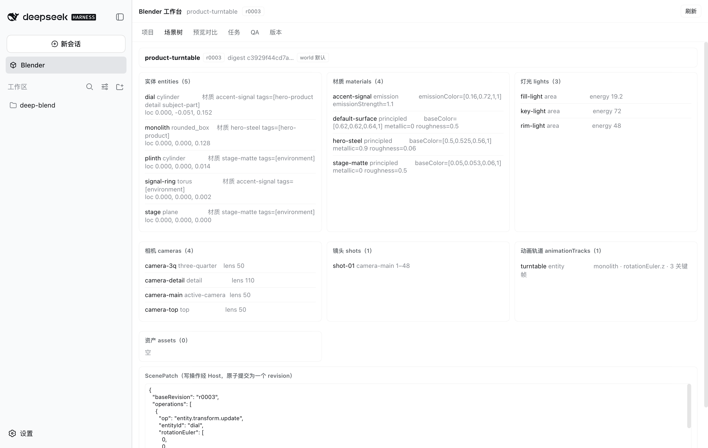
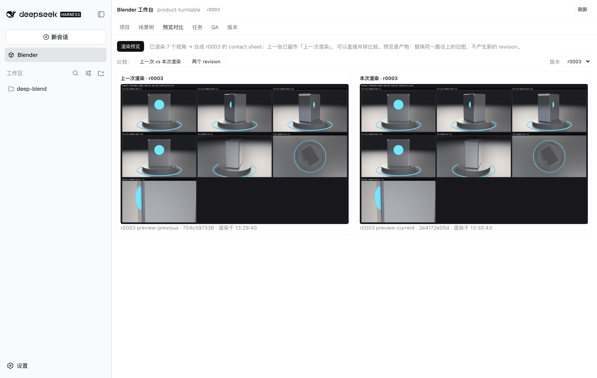
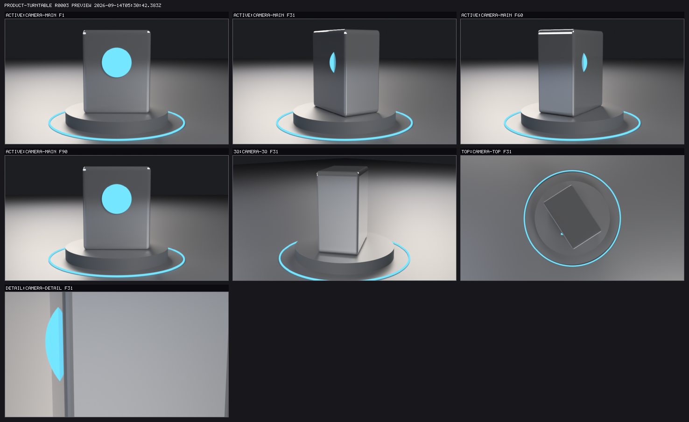

# DeepBlend Studio

> 基于 **DSH 创造模式 + DeepSeek-Flash** 的 Blender 3D 动画 Agent 工作台
> 主规格：`SPEC.md`（V2.0）　逐里程碑的结论与验收数字：`deepblend/docs/milestone-status.md`

---

## 看一眼

下面三张图不是画出来的，是**从跑着的产品里截出来的**：一个真实的 `dsh web`、一个真实的
Chrome、一份真实的 Blender，项目由**点**工作台上的控件建起来（和 `usage.md` 教的是同一批
控件）。生成它们的工具是 `deepblend/tools/capture-docs-images.mjs`（`npm run docs:images`），
重跑它就能更新这三张图；`contract/docs-images.test.mjs` 盯着它们是否还在、是否还是截图。

工作台：项目头 + 当前 revision，以及 Host 现算的场景树。



预览对比：一次预览渲七个视角合成一张 contact sheet；改一次材质再渲一次，左右就是
「上一次渲染」和「本次渲染」，各自带自己的 digest 与渲染时间。



上面那次渲染的产物本身 —— 七个视角（主动相机在动画的四个采样帧，加上四分之三、俯视、特写
三个机位）拼成的一张图：



---

## 这是什么

`SPEC.md` 是唯一主规格，本仓库是它的实现。架构分三个平面：

```
DSH Host Composition        →  packages/deepblend/bundle/cordis.patch.yml
  共享服务：Blender 执行、Project/Revision Store、原子提交事务、UI Host 半

DeepBlend Agent Presets     →  ~/.dsh/.agent-presets/{deepblend,deepblend-dev}/
  单个会话自己的模型可见工具与提示词

Blender Runtime             →  packages/deepblend/provider-local/python/
  受控 bpy 执行、确定性 JSON 协议、SceneSpec 编译器
```

**核心规则**：发布服务的行必须放 Host composition；preset 只能放模型可见工具、
Persona 与会话级能力。工具行不发布任何服务，因此天然满足 SPEC §4.4。

---

## 目录

```
deepblend/
  schemas/            权威 JSON Schema（SPEC §5.2）：scene-spec / scene-patch / job-result
  presets/            agent preset 的**源**（SPEC §5.2）：deepblend/（正式，最小权限）与
                      deepblend-dev/（开发）；preset 自带的 skills/ 随目录一起部署
  fixtures/           产品转台 golden 场景；室内房间（正确参考 + 三个植入缺陷的派生场景）
  docs/               **手册（使用视角）**：install / usage / recovery —— 见上面「三份手册」
                      **规格与记录**：dsh-baseline / runtime-audit / architecture-decisions
                      / tool-contracts / milestone-status / m2-brief / m3-brief / m4-brief
                      **安全**：security.md —— SPEC §15 的逐条对照表（含**没做到的那几条**）
                      **实测日志**：probe-m3-restart.log / probe-m3-delivery.log / probe-m4-client-loop.log
                      / probe-dsh-plugin-install.log（两条装法各自测到什么，见「5. 安装进 DSH profile」）
                      / probe-disk-full.log（卷写满时会发生什么：一帧不丢、可续渲）
                      / probe-coverage.log（整套验收执行了产品的哪些行，以及量具看不见什么）
  docs/images/        README 里的三张图 + manifest.json（由 tools/capture-docs-images.mjs 生成）
  tools/              link-workspace.mjs —— 把 node_modules 链接到已安装的 DSH 部署（全新 clone 的第一步）
                      workspace-layout.mjs —— 从源码里读出「要链接哪些包」，链接器与契约测试共用
                      dsh-baseline.json —— DSH 兼容性锚点（版本号）的机器可读来源
                      install-blender.mjs —— 下载/校验/安装受管 Blender 到 .tools/（免 sudo）
                      blender-release.json —— Blender 的 pin：版本、URL、字节数、sha256
                      install-plugin.mjs —— 装配 profile：包链接 + bundle 注册 + operator layer
                      operator-layer.mjs —— 从 bundle 推导存储位置；安装器与测试 harness 共用
                      create-demo-project.mjs —— 在真实 store 中生成演示项目
                      make-visual-fixtures.mjs —— 从室内房间派生三个缺陷场景
                      visual-review-live-probe.mjs —— 直接调用视觉模型的最小探针
                      inspect-checkpoint.py —— 量编译后几何
                      m3-restart-probe.mjs —— M3 的第一个任务：真实 kill -9 重启探针
                      m3-delivery-acceptance.mjs —— 真实项目上的 1080p 交付（约 30 分钟）
                      install-presets.mjs —— 把 deepblend/presets/ 部署到 $DSH_HOME（--check 只报漂移）
                      browser-driver.mjs —— 无依赖的 CDP 驱动（M4 的浏览器验收用它开真实 Chrome）
                      dsh-web-harness.mjs —— 自带 DSH home 与项目 store 地启动一个 dsh web
                      ui-loop-probe.mjs —— M4 的第一个任务：量「改一行客户端代码怎样才能看见」
                      capture-docs-images.mjs —— 从真实产品里截出上面那三张图（改 UI 后重跑它）
                      dsh-plugin-install-probe.mjs —— 在临时 DSH_HOME 上量「DSH 自己的装法」到底做了什么
                      disk-full-probe.mjs —— 在一个真的 24 MiB 卷上把磁盘写满，看宿主怎么收场
                      coverage-probe.mjs —— 跑整套并列出产品里从没被执行过的行（含它自己的盲区）
                      count-assertions.mjs —— 契约层断言总数怎么数出来的（README 那组快照的命令；
                                              规则自己有测试，因为它写错过一次，D143）
                      probe-target.mjs —— 探针该测哪个 revision：从 store 的 currentRevision 读，而不是记住一个 id
                      coverage-merge.mjs —— 那份读数的合并规则：行级判定写在模块里，因为它在四轮里错过四次
                                            （`contract/probe-merge.test.mjs` 用合成的 V8 报告驱动它）
  tests/              单元、契约、Blender 集成、组合激活、真实模型 e2e
    contract/         58 个 *.test.mjs
    lib/              dsh-deployment.mjs —— 定位并加载运行中的 DSH 部署
                      command-claims.mjs —— 「文档里点名的命令是否存在」只有一份（模板与证据日志共用）
                      milestone-claims.mjs —— 「不许复述里程碑状态」只有一份（README / CONTRIBUTING / 模板共用）
                      m3-host-child.mjs —— 独立进程里的 Host（供重启套件 fork）
                      spec-tools.mjs —— 从 SPEC.md §11 读出工具清单（三个套件共用这一份）
                      tool-plane-harness.mjs —— 用 stub 的 tools 注册表与 stub 的 blenderStudio 组装工具面
                                                 （两个契约套件共用；不需要 Blender 也能跑失败分支与卡片标题）
    blender-integration/  M0 能力探测 + M1 批量 SceneSpec + M2 视觉闭环 + M3 持久渲染
    composition/      Host 组合激活 + preset 工具面（M0–M3）+ UI 平面（座位表与闭集路由）
    e2e/              ui.e2e.mjs —— 真实浏览器验收（自带 dsh web 与项目 store）
                      visual-live.e2e.mjs / ui-live.e2e.mjs —— 真实模型调用（不进 run-all.sh）

packages/deepblend/
  contracts/          纯数据与纯规则：Schema、语义校验、digest、稳定错误码、Canonical 投影、
                      PNG 编解码 + contact sheet 合成、VisualIssue 评分器、修复循环控制器
  provider-local/     BlenderRuntime：ctx.subprocess 传输层 + python/ 运行时
    python/           bootstrap.py 分派器 + 6 个动作模块
  host/               blenderStudio 门面、Project Store、Revision 事务、路径守卫
  tool/               16 个模型可见工具（Agent preset 平面，不发布服务）
  ui/                 工作台 UI：Host 半（闭集 HTTP 路由）+ Client 半（lib/client.js，
                      手写的 CJS 工厂，无打包步骤 —— 改一行存盘即可在打开的页面里看到）
  bundle/             Host Bundle：cordis.patch.yml + dsh.bundle 声明
```

---

## 快速开始

### 0. 这台机器上得有什么

| 需要 | 用在哪 | 没有它会怎样 |
|---|---|---|
| **macOS arm64** | 受管 Blender 是一份 macOS 的 DMG（`deepblend/tools/blender-release.json` 的 `platform`） | `npm run blender:install` / `blender:check` 报「只认得钉住的那份 macOS arm64 构建」并**退出 2**，同时告诉你去设哪个键；别的平台自装 Blender 5.2.1 并把 `blenderPath` 设在 operator layer 即可。**契约层不受影响**（CI 就跑在 Linux 上） |
| **Node ≥ 22**（`package.json` 的 `engines`，CI 跑的就是 22） | 一切 | 跑不起来 |
| **一个已安装的 DSH 部署**，版本钉在 `deepblend/tools/dsh-baseline.json` | 本仓库的 import 目标 | 第 1 步的报错会点名要装哪一个版本 |
| **Python 3** | 只有一处：`contract/render-job.test.mjs` 用普通 CPython 跑 `deepblend_util.py`，比对两边的帧命名 | 那**一条**失败并说清缺什么，其余 77 条照跑 |
| **git** | 契约层里读仓库状态的两条断言 | 没有 `.git` 时那两条**报「not a git checkout」并跳过**（退出码仍然是 0） |
| **Blender 5.2.1**（`npm run blender:install`） | 需要 Blender 的那几层 | 契约层照跑；`run-all.sh` 找不到 Blender 会直接以 2 退出 |
| **ffmpeg + ffprobe**（macOS：`brew install ffmpeg`） | **只有交付的编码那一步**：`blender_final_render` 渲完最后一帧之后把它编成 MP4，`blender_export` 同理 | **渲染照跑、帧一帧不丢**，只有编码以 `ENCODER_NOT_FOUND` 失败，消息里点名 ffmpeg 与装法。装上之后对同一个 job 调 `blender_export` 即可补上交付（`recovery.md` §3；第 30 轮实测：2 帧的 job 渲完、编码失败、帧保留、装好编码器后导出并发布成功） |
| **Google Chrome** | 只有 `npm run docs:images` 与 M4 的浏览器验收 | 那两件事不跑，其余不受影响 |

**Python 3 这一行是 2026-09-14 才写下的**（`milestone-status.md` §25）：在那之前它是一条
谁也不知道的依赖，而缺了它的机器看到的是 `spawnSync python3 ENOENT` 的堆栈——
它落在 60 条断言里的**第 15 条**，于是后面 45 条一起消失，还没有汇总。同一个仓库里，
产品侧早就把「每个失败都必须是可分支的结果、不许是堆栈」写成了规矩（SPEC §9.4），
而这条规矩此前没有用在**检查产品的那个文件**上。

### 1. 装配工作区（全新 clone 的第一步）

本仓库的 `node_modules/` **不在版本控制里**：它没有任何内容，只有 12 个指向
**已安装的 DSH 部署**与本仓库 `packages/` 的绝对符号链接（见 `.gitignore`）。
所以刚 clone 下来的仓库**解析不了自己写的任何一句 import**，16 个契约套件会在跑第一条
断言之前全部死于 `ERR_MODULE_NOT_FOUND`：

```
$ node deepblend/tests/run.mjs
Error [ERR_MODULE_NOT_FOUND]: Cannot find package '@deepblend/dsh-blender-contracts'
DeepBlend tests: 0/16 file(s) passed
```

这不是假设——2026-09-14 DSH profile 被重装后，本仓库就是这个状态。补上这一步：

```bash
npm run setup          # = node deepblend/tools/link-workspace.mjs
npm run setup:check    # 只报告漂移，不改动任何文件
```

它**不写 DSH 安装目录，也不写 `$DSH_HOME`**：只在仓库根建 `node_modules/@deepseek-ai/*`
与 `node_modules/@deepblend/*` 两组符号链接，然后**逐个真的 import 一遍**来验证。
要链接哪些包不是写死的清单，而是**从本仓库源码里读出来的**——新增一句
`import '@deepseek-ai/dsh-xxx'` 只需重跑本命令，不需要改任何脚本。

为什么不直接写进 `package.json` 的 `dependencies`：那会在仓库里装下**第二份 harness**，
它可以和真正运行 DeepBlend 的那个部署各自漂移，于是契约套件会对着一份产品并不加载的
cordis 变绿。理由与实测见 `deepblend/tests/lib/dsh-deployment.mjs`；这条不变式由
`deepblend/tests/contract/workspace-links.test.mjs` 守住。

### 2. Blender

Blender 安装在工作区内（免 sudo、免系统目录写入）：

```
.tools/Blender.app/Contents/MacOS/Blender     # Blender 5.2.1 LTS, arm64
```

来源与校验和见 `deepblend/docs/dsh-baseline.md` §5。`.tools/` 已被 git 忽略。

### 3. 运行全部验收测试

```bash
bash deepblend/tests/run-all.sh
npm run verify:clone          # 换一台「从没见过这个项目」的机器，也能装上吗？
```

`verify:clone` 把上面那四步**按顺序、在一个全新的 clone 加一个全新的 `DSH_HOME` 上**
走一遍，然后**在那个 clone 里**跑契约层；它不碰你自己的 `$DSH_HOME`。
这条命令是一次真的走查逼出来的：四步各自都对，缺的是**它们之间的那个前提**
（`milestone-status.md` §21）。

**它现在也在 CI 里跑**（`milestone-status.md` §28）。在那之前，「陌生人也能装上」是一条
**只有人记得才会被验证**的断言——写它的那一次量过，之后六个轮次的改动没有人再跑过它。
它在 CI 里既不需要 pnpm 也不需要网络：clone 的是 runner 上那份 checkout，
四步里有三步是纯 Node，而 `dsh --profile web --dump-config` 实测在没有 pnpm 的 PATH 上
照样成功（容器里跑过整条 job）。

预期：**16 个套件、73 个文件**全部通过。其中契约层（`run.mjs`，不需要 Blender）是
**58 个文件 = 1388 项自计断言（29 个文件打印计数）+ 285 个 `node:test` 用例（29 个文件）**。
需要 Blender 的那几层把总断言数推到 **1400 项以上**（M4 那一次完整 run 记为 1400；
M5 之后重测过一次，逐套件数字见 `deepblend/docs/milestone-status.md` §14）。

**这四个数字里，前两组是断言，后两组是上一次完整 run 的读数。** 套件数、文件数、工具数由
`contract/documented-counts.test.mjs` 直接从 `run-all.sh`、契约目录和 `UI_TOOL_CARD_KEYS`
里读出来比对——**改了代码不改文档，它会红**。而**断言总数没有这层保护**：只有真跑一遍才知道
它是多少，而一个「为了数其它套件而跑其它套件」的测试会让整套的成本翻倍。所以 1388 和 285 是
快照，不是承诺；你机器上的数字以你自己的 run 为准。
**取这个快照的命令是 `node deepblend/tools/count-assertions.mjs`**：它按 `run.mjs` 的规则发现文件、
跑那些会打印计数的，再把每份摘要加起来——**它自己有一条测试**（`contract/assertion-counter.test.mjs`），
因为它的规则写错过一次：`\(s\)?` 让「）」可选而「（」仍是必需的，
于是 `store.test.mjs` 的 `47/47 checks passed` 没被数进去，审计因此报出 1202（真值是 1249，
D143）。

**一个会咬人的计数口径**：`preset-source.test.mjs` 的断言数取决于**本机装没装 preset**
——没装时它报 19 项，装了之后报 21 项。所以拿两个不同机器（或同一台机器装 preset 前后）的
总数直接相减，会凭空多出或少掉两项。上面那个 1388 是**装了** preset 的读数；同一份快照在没有装
preset 的机器上会少掉 `preset-source.test.mjs` 的那两项。
单跑某一层：

```bash
node deepblend/tests/run.mjs                                    # 单元 + 契约（不需要 Blender）
node deepblend/tests/blender-integration/probe.e2e.mjs          # M0 能力探测
node deepblend/tests/blender-integration/fixture.e2e.mjs        # M1 SceneSpec + revision 回放
node deepblend/tests/blender-integration/visual-loop.e2e.mjs    # M2 多视角 / 评分 / 修复 / handover
node deepblend/tests/blender-integration/render-job.e2e.mjs     # M3 重启 / 续渲 / 取消 / 交付
node deepblend/tests/composition/activation.e2e.mjs             # Host composition 是否真的激活
node deepblend/tests/composition/tool-plane.e2e.mjs             # M0 preset 工具面 + 降级
node deepblend/tests/composition/tool-plane-m1.e2e.mjs          # M1 的 7 个工具 + 无 checkpoint 的 revision 仍然可预览
node deepblend/tests/composition/tool-plane-m2.e2e.mjs          # M2 全部 10 个工具 + 图片回传
node deepblend/tests/composition/tool-plane-m3.e2e.mjs          # 全部 16 个工具 + 真实交付
node deepblend/tests/composition/hardening.e2e.mjs              # M5 安全加固：白名单/截止时间/输出上限/采样预算/工作区边界
node deepblend/tests/composition/concurrency.e2e.mjs            # M5 并发：两个会话打同一个 store，以及把它们隔开的 realm
node deepblend/tests/composition/approval.e2e.mjs               # M5 审批：阈值以上没有授权就一帧都不渲
node deepblend/tests/composition/assets.e2e.mjs                 # M5 资产：本地自动、网络需审批、以及两者之间的上限
node deepblend/tests/composition/ui-plane.e2e.mjs               # M4 UI 平面：闭集路由 + 座位表
node deepblend/tests/e2e/ui.e2e.mjs                             # M4 真实浏览器验收（自带 Host）
```

**M3 的两个套件会真的渲 1080p、真的编码**，所以它们是整个 run 里最慢的（约 5–10 分钟）；
**M4 的 `e2e/ui.e2e.mjs` 会启动自己的 `dsh web`、开一个真实 Chrome，并真的渲一次预览、
起一次渲染再取消**（约 1–2 分钟，全程在自己的临时 store 里，不碰开发者的数据）。

其中 `contract/patch-resolution.test.mjs`（91 项）值得单独知道：它全部来自**在真实项目上
使用产品**时暴露的缺陷——patch 结果没被解析完整、bare generator 产生 NaN、
主体与视角依赖了会被排序破坏的数组顺序。每条断言写的是**用户当时看到的现象**。

**需要真实模型调用的一项，不在上面**（它花 token，需要 credential store）：

```bash
node deepblend/tests/e2e/visual-live.e2e.mjs      # 模型真的看图、识别缺陷、修好并提高分数
```

### 4. 生成演示项目

```bash
node deepblend/tools/create-demo-project.mjs
```

在真实的 `.deepblend/projects/` 下创建 `watch-commercial`：r0001 = 产品转台场景，
r0002 = 一次灯光/材质调整并带预览。幂等：已存在则报告状态并退出，不做任何修改。

生成器只铺到 r0002；**当前项目已推进到 r0023**，内容对齐 SPEC.md:150 那条需求
（15 秒、黑背景、产品环绕、表盘逐渐点亮、片尾品牌标）。r0019–r0023 每个 revision 的
`operation-manifest.json` 都完整记录了操作，可直接重放或 `blender_revision_restore` 回退。
这一段的决策与被实测挡回来的地方见 `architecture-decisions.md` §5D（D42–D46）。

### 5. 安装进 DSH profile

两个平面各装一次。**两者都会在 profile 下次启动时才生效。**

```bash
npm run plugin:check     # 只报告漂移：六个包链接 + dsh.profile.bundles 里那一行
npm run plugin:install   # 把 @deepblend/* 链接进 profiles/node_modules，并注册 Host Bundle

npm run presets:check    # 只报告漂移（本机没装过则报「未安装」，那不是漂移）
npm run presets:install  # 把 deepblend/presets/ 部署到 $DSH_HOME/.agent-presets/
```

**有两条装法，而且它们不是等价的**——选哪条取决于你是**用**它还是**改**它：

| | `dsh plugin --profile web add <六个包的路径>` | `npm run plugin:install` |
|---|---|---|
| 谁用 | 只想把它跑起来的用户 | 在本仓库里改代码的人 |
| 认证 | DSH 自己的路径 | 自己写的，**不经过 DSH** |
| 需要 | pnpm 在 PATH 上（`dsh plugin` 不内置它） | 只要 Node |
| `dsh.profile.bundles` | 自动加 | 自动加 |
| 包落在哪 | `profiles/web/node_modules/@deepblend/` | `profiles/node_modules/@deepblend/` |
| 项目存储在哪 | `<DSH_HOME>/deepblend`（产品默认） | `<repo>/.deepblend`（写 operator layer 钉住） |
| `--check` | 无 | 有 |

**第二条存在的唯一理由是最后两行**：本仓库的工具全都工作在 `<repo>/.deepblend`，
而部署默认读 `<DSH_HOME>/deepblend`——于是磁盘上明明有项目，面板里却是空列表。
实测见 `deepblend/docs/probe-dsh-plugin-install.log`（`tools/dsh-plugin-install-probe.mjs`
在临时 `DSH_HOME` 上跑完整条路）：装完能服务，`/deepblend/capabilities` 返回
**HTTP 200 / hostApiVersion 4**，但 `projectsRoot` 落在那个临时的 `DSH_HOME` 下。

`install-plugin.mjs` 于是做三件事：把 `@deepblend/*` 链接进
`$DSH_HOME/profiles/node_modules/`，把 `@deepblend/dsh-blender-bundle` 加进
`dsh.profile.bundles`，以及**推导出**那一层 operator layer 把存储钉在本仓库上。
它不碰 DSH 安装目录，也**不会覆盖别人写的** `cordis.patch.yml`（见下）。

这两步以前只写在文档里。2026-09-14 profile 被重装后它们都没了，代价不是理论上的：
M4 的浏览器套件起了自己的 `dsh web`，而它链接真实 profile 的 `node_modules`——
bundle 解析不到，工作台就永远不出现，报错只有一句 `never served /deepblend/capabilities`。

#### 存储放在哪里（`--portable`）

M5 之后 bundle 里**没有任何路径**：不配置时产品把项目存在 `$DSH_HOME/deepblend`
（SPEC §17）。这对一次**安装**是对的，对一个 **clone** 是错的——本仓库的工具全部在
`<repo>/.deepblend` 上工作，产品若去读 `~/.dsh/deepblend`，工作台会对着一个明明存在于
磁盘上的项目显示空列表。

所以 `install-plugin.mjs` 默认还会写一层 **operator layer**，把这个部署的存储钉在
`<repo>/.deepblend`；`--portable` 则跳过它（并删掉自己以前写的那个），让部署留在产品默认值上。
那一层是**每次从 bundle patch 推导出来的**，不是手抄的：patch 层的 `config` 是整体替换而不是
合并（实测，D74），所以覆盖必须重述全部键，而重述的唯一安全做法就是推导。
`--check` 会重新推导并比对，于是「bundle 改了但没传导到部署」会被报出来而不是被忽略。

重启后复核：

```bash
dsh --profile web --dump-config | grep -A6 deepblend    # 确认三行已组合；路径只应来自 operator layer
dsh web                                                 # 重启后生效
```

重启后新建 **DeepBlend 开发模式** 会话时工具清单为 **16 个**；**DeepBlend Studio**（正式 preset）
少得多，且没有 Shell、没有文件写入、没有 Web、没有 Creator Tool（见 `milestone-status.md` §16）。

---

## M3 的核心机制

### 帧是事实来源，记录只是它的缓存

一份交付渲染实测 **19.6–41.4 秒/帧**，450 帧 = 3.4 小时。这样的任务**必然**会被打断。
所以「哪些帧已经渲好」的权威是**磁盘上的帧文件**，而不是 job 记录里的计数：

* 记录里的 `completedFrames` 是缓存，永不覆盖磁盘；
* 子进程 fsync 的 `events.jsonl` 是佐证，也不是权威；
* 一段被 `kill -9` 截断的 PNG **存在**，但它不是一帧——账本按
  「PNG 签名 + IHDR 尺寸 + 尺寸下限 + IEND 结尾」判定，把它算进**重渲**集合。

要渲的集合因此是 `missing + corrupt`。**这就是「可只渲缺失帧」这条验收的全部内容。**

### 一次重启里，真正的证据是那个孤立进程

探针（`tools/m3-restart-probe.mjs`）实测：Host 被 `SIGKILL` 之后，它启动的 Blender
**活着**——它是 detached 进程组的组长，而且仍在往「恢复流程马上要描述的那个目录」里写。
所以恢复的顺序是证据而不是风格：**先停孤儿，再读账本**。

而「哪个 pid 是它」这件事**只能由子进程自己写下来**：
`ctx.subprocess.spawn` 的 handle 实测没有 pid 字段。于是 `bootstrap.py` 在碰 bpy 之前
先写下 `process.json`，并且每次 attempt 带一个 token——Host 只接受 token 相同的身份文档。
（这条 token 是修补「续渲读回上一次 attempt 的死 pid」时加的，见 D58。）

### 交付清单要能让人**不看磁盘**就判断完整

`output/delivery-manifest.json` 同时记录**声明**与**实测**：视频路径、字节数、sha256，
job 声称的帧数/时长/fps/分辨率，`ffprobe -count_frames` 实际量到的，
两者之间的**全部**不一致，以及 `completeness` 自判。不一致就以 `ENCODE_VERIFY_FAILED`
失败，并且**什么都不发布**——一份描述着不存在文件的清单，比没有清单更糟。

---

## M2 的核心机制

### 模型确实看图，但分数不是它给的

一次视觉审查产出三件**分开的**东西：

| | 谁产出 | 可否复现 |
|---|---|---|
| `score` | Host，从渲染像素的确定性测量算出 | ✅ 纯函数，有 56 项契约测试 |
| `issues` | Host，每条带触发它的那个数字 | ✅ |
| `reported` | **视觉模型**，它说自己在图上看到了什么 | ❌ 但每条都要过校验：视角必须真实存在、类别必须在闭集内、证据不能为空 |

把两者分开是 M2 最重要的一条设计：如果修复循环同时写它自己被评判的那个数字，
「评分提高」就变成关于模型的声明，而不是关于渲染的声明。

接触表作为 **image block** 随工具结果返回（字节经 `attachments` 归一化后只留引用），
所以工具结果里的图就是模型看到的那张图。

### 遮挡是**定义性**测量，不是启发式

```
相机 → 该像素的一条射线：这条视线上最近的东西是谁？
  主体最近   → 该像素属于主体
  其他角色最近 → 该像素被遮挡
```

前两版分别用「除我之外的一切」和「其他被跟踪实体」的掩码比较，都错得很安静：
前者让地板把每个主体测成 100% 遮挡，后者让「屏幕矩形重叠」冒充遮挡。
`environment` 标签的实体会被排除在跟踪之外——因为**背景板不是遮挡物**。

### 只采纳分数真的提高的修复

每一轮 = 一次 `applyScenePatch` → 重新渲染 → 重新测量。分数没提高就**回退指针**：
revision 留在历史里，但项目不会前进到一个更差的版本。停止条件三条——
分数达标、迭代上限（默认 5）、同一指纹连续未改善 2 次——停止而未达标时返回 handover：
可继续工作的 revision、仍开放的问题（带测量）、已试过未采纳的 revision、具体下一步。

---

## M1 的核心机制

### SceneSpec 是事实来源，`.blend` 是编译产物

项目的权威状态是 `revisions/<id>/scene-spec.json`。`.blend` 由 spec 编译而来，可重建、
可缺失（`saveCheckpoint:false` 的 revision 就没有）。这样修订历史才可 diff、可审计、
可幂等重放。

### 每次成功修改 = 一个不可变 revision

```
验证 patch → 解析幂等键 → 比对 baseRevision → 在内存中应用
  → JSON Schema + 语义校验 → 在 staging/ 中编译 Blender 场景 → 技术校验
  → 写 revision manifest → 一次 rename 原子发布 → 移动 current 指针 → 记录幂等结果
```

三条因此成为**结构性质**而非"记得要做的清理"：

- **失败不污染当前 revision** —— 当前 revision 的目录从未被打开写入。已用递归内容哈希证明。
- **不存在半提交 revision** —— 没被 `rename` 的目录不是 revision。
- **崩溃最多留下 staging** —— 无人读取，下次事务清除。

### 幂等键省略时自动派生

`{projectId, baseRevision, actor, stage, operations}` 的哈希。于是**无意的重试默认安全**：
完全相同的重试返回首次结果；真正不同的 patch 正常应用；同样的操作针对更晚的 baseRevision
得到不同的键。要**有意**重复应用同一组操作，就显式给 key。

**幂等查询早于冲突查询**：谨慎的调用者重试时，第一次通常已经成功、项目已经前进——
若先查冲突，回应会是 `REVISION_CONFLICT`，而调用者唯一的动作是重读重提，
恰好制造出幂等键要防止的那次重复提交。

### 失败永远是可分支的结果，不是堆栈

所有错误归入 `BlenderErrorCode` 稳定表；工具返回 `ok:false` + `errorCode` + `message`。
只有**没有**稳定码的意外才附带堆栈——那说明是 bug，此时堆栈才是唯一有用的信息。

完整决策记录与理由见 `deepblend/docs/architecture-decisions.md`（D11–D68），
运行时实测（含 M2 图片回传探针）见 `deepblend/docs/runtime-audit.md` §7.2，
工具契约见 `deepblend/docs/tool-contracts.md`。

---

## 三份手册

| 想做什么 | 看哪一份 |
|---|---|
| **装上它**——从 clone 到「新建会话里能选到 DeepBlend Studio」，四步各有 `--check`，以及每一步**不**验证什么 | `deepblend/docs/install.md` |
| **用它**——一次会话长什么样、每个工具的分工、成本模型、工作台六个页签、一个完整例子 | `deepblend/docs/usage.md` |
| **救它**——渲染被 `kill -9`、半张帧、帧齐了没视频、改错想回退、宿主比包旧、项目列表是空的 | `deepblend/docs/recovery.md` |

上面「快速开始」是同一套命令的**开发视角**，三份手册是**使用视角**：手册只讲怎么用与
怎么判断，设计的理由留在 `deepblend/docs/` 的其余文档里，两边不重复。

---

## 安全

SPEC §15 列的每一条安全要求，都在 `deepblend/docs/security.md` 里查到**它由哪一行代码负责、
被哪一条断言盯着**，或者写着**它没做**——这份表由 `contract/security-controls.test.mjs` 盯住：
SPEC 增删一条要求、表里指到的文件或片段消失、或者某条缺口没有在
`milestone-status.md` §7 里编号，都会变红。报告漏洞见根目录的 `SECURITY.md`。

## 许可与参与

本项目采用 **MIT 许可证**（见 `LICENSE`）。

想改点什么，先看 `CONTRIBUTING.md`——里面有三条不知道就会白干几小时的规则：
`npm run setup` 不是可选的、改动只能落在三个平面中的一个、以及新增 import 之后不需要
改任何脚本（清单是从源码读出来的）。提交前那张清单同时是 `.github/PULL_REQUEST_TEMPLATE.md`。

报了 bug 请用 `.github/ISSUE_TEMPLATE/bug_report.yml`：它会要 Blender / DSH / 平台三个版本，
因为本仓库的每一次测量都是对着 pin 住的版本做的，缺了这三样，报告只能靠猜。
`deepblend/docs/recovery.md` 里已经写下的失败，先在那里找一眼。

---

## 当前状态与下一步

**这个仓库的当前状态就是一条命令的输出**，不是这一段文字：

```bash
bash deepblend/tests/run-all.sh      # 16 个套件；上面「快速开始」给了预期
```

**逐里程碑的结论、每条验收的证据、以及已知的偏差与缺口**（包括 SPEC §15 里没做到的那几条、
以及它们为什么没做）都在 `deepblend/docs/milestone-status.md`——那份文档是唯一记录，
这里**不复述**。理由是这套文档反复付过代价的那一条：**同一件事写两处，就会有先烂的那一处**。
这一节曾经把五个里程碑一起判为验收完成，紧接着又说最后一个里程碑应当另起一个会话——
而那两句话在最后一个里程碑做完之后的**第六个轮次**里还挂在这里（§33）。

`contract/docs-consistency.test.mjs` 现在盯着这件事：README 里出现任何一种对里程碑状态的
断言（完成的判决、进行中的报告、下一步的计划）都会变红。**这一节只写「去哪儿看」，
不写「现在到哪儿了」**——前者永远是对的。

**下一步**是 SPEC 第二十节列的 M6 扩展项（Blender Live Bridge、Blender Add-on、远程 Worker、
对象存储、多 GPU、角色动画、复杂模拟、独立全屏工作台）。SPEC §21.1 明确写着
「不得在一次会话中横跨多个未完成里程碑」且「停止，不自动进入下一里程碑」，
所以它是一份**待办列表**，不是一件正在进行的事。

**已经跑通过的东西**（每一条都有对应的套件，不是叙述）：一次真实的视觉闭环里模型独立指出
植入的遮挡而确定性评分器独立给出同一结论（`blender-integration/visual-loop.e2e.mjs`）；
一次真实的交付里 Host 在渲染到第 6 帧时被 `SIGKILL`，新进程停掉孤儿渲染器、
从帧本身重建账本并补渲完剩下的 54 帧，最终编码出 1920×1080 的 `output/final.mp4`
（`blender-integration/render-job.e2e.mjs`，以及逐行的 `probe-m3-delivery.log`）；
以及一个真实 Chrome 里点击完成「建项目 → 改场景 → 渲预览 → 起渲染 → 取消」、
刷新后从 Host 恢复同一个项目与 job（`e2e/ui.e2e.mjs`）。
