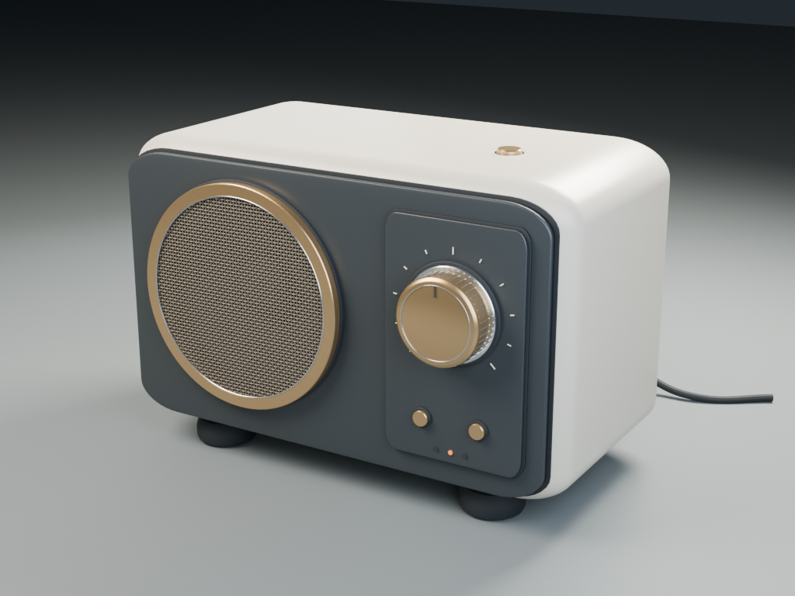

# DeepBlend Studio

[](https://awesome-dsh-plugin.com)

> A Blender 3D animation workbench for **DeepSeek Harness** (`dsh`).
> **SceneSpec is the source of truth; `.blend` is a compiled artifact.**

**English** | [中文](README.zh.md)

---

Start from one of four [product recipes](deepblend/docs/recipes.md) in the workbench, adjust color,
roughness and exposure, then create a project with a rendered preview. `blender_recipe_list` exposes
the same catalog to agents. Each project retains its recipe version, license, source hashes and
parameter values. Metal materials now support explicit anisotropic reflection directions.
The [handled cup generator](deepblend/docs/modeling.md#连为一体的带把手杯体) builds a cup and handle in one closed mesh, with editable wall thickness and attachment roots.
After creation, the [object editor](deepblend/docs/usage.md#41-调整已有对象) lets you adjust profiles,
bevels, arrays and local materials, render the change, and restore the previous scene with a revision guard.
Save up to four [reference images](deepblend/docs/reference-images.md) with a revision's design goal.
Reviews use those exact project assets and distinguish technical measurements from evidenced artistic judgments.
Use the [asset library](deepblend/docs/assets.md) to upload and preview local GLB, PNG/JPEG and HDR/EXR
files, then insert a model, bind a texture or set environment lighting. Model imports preserve source materials.

## Install

```sh
dsh plugin --profile web add 'github:pearjelly/deep-blend#path:/packages/deepblend/bundle'
```

Then restart `dsh web`. A new session can select the **DeepBlend Studio** preset, and
the workbench appears in the sidebar.

One command installs both planes:

| Plane | What arrives |
|---|---|
| **Host composition** | the Blender runtime provider, the project/revision store, and the workbench's host half |
| **Agent preset** | **DeepBlend Studio** and **DeepBlend dev mode**, deployed into `<DSH_HOME>/.agent-presets/` — the 17 model-visible tools belong to a preset, not to the host, so a session only sees them when it runs on one |

> The `#path:` form is quoted because `#` starts a comment in a shell. Requires **pnpm** on
> `PATH` (`dsh plugin` forwards to it) and a repository it can reach: pnpm resolves the
> `github:` spec through an anonymous codeload tarball, so the repository must be public —
> which it now is.

### Requirements

| | |
|---|---|
| **DSH** | `0.1.5-rc.2` — the version this repository is measured against (`deepblend/tools/dsh-baseline.json`). The plugin declares what it needs as `peerDependencies`, which is what the market's compatibility preflight reads. |
| **Blender** | `5.2.1`. The repository ships a managed, checksum-pinned install for **macOS arm64** (`npm run blender:install`); on any other platform install Blender 5.2.1 yourself and point `blenderPath` at it in the profile's patch layer. Upstream publishes **`linux-x64` only** — there is no Linux arm64 build — so the supported Linux is x86_64. |
| **ffmpeg + ffprobe** | Only for the **delivery** step that encodes frames into an MP4. Install it the way your platform does: `brew install ffmpeg` (macOS), `sudo apt install ffmpeg` (Debian/Ubuntu), `sudo dnf install ffmpeg` (Fedora), `winget install ffmpeg` (Windows) — or point `ffmpegPath`/`ffprobePath` at an absolute path. Without them rendering still runs and no frame is lost: encoding fails with `ENCODER_NOT_FOUND` and the message names the binary. |
| **Node.js** | ≥ 22 — for the repository's own tools and test suites, not for the plugin. |

---

## See it

These are not mockups: they were captured from a running `dsh web`, a real Chrome and a real
Blender by `deepblend/tools/capture-docs-images.mjs`, and the project in them was built by
clicking the workbench controls. Re-run it to refresh them.

Workbench — project header, current revision, and the scene tree the host computes:


Preview comparison — one preview renders seven views into a contact sheet; change a material,
render again, and the two sheets sit side by side as actual r0002/r0003 revision images with their own digests and render times. The capture manifest records both source-scene and displayed-image hashes:


The render itself — seven views (the active camera sampled at four animation frames, plus
three-quarter, top and detail) composited into one sheet:


---

## Rebuildable product examples

The [quality benchmarks](deepblend/docs/quality-benchmarks.md) include a metal lamp,
a hollow glass vessel with a ceramic tray, and a detailed desktop speaker. Each has an
original design brief, public SceneSpec, geometry checks, fixed camera and render budgets,
clay views, a deliberately simplified ablation, and a real frame sequence.

| Metal lamp | Glass and ceramic | Desktop speaker |
|---|---|---|
|  |  |  |

These are unedited Blender renders; [preview provenance](deepblend/benchmarks/previews/manifest.json) records their inputs and artifact hashes.

After setting up the development environment and Blender, run `npm run quality:check`, then
`npm run quality:render -- --tier final`. Results stay local and include an interactive gallery,
source snapshots, timings and independently verified artifacts. The ablation is not a historical
plugin output; technical success still requires a separate artistic review.

---

## What you get

**17 model-visible tools** across four jobs — inspecting a scene, changing it, judging a
render, and delivering a video:

* **Scene** — create a project, read it, read and patch the scene, validate it
* **Preview** — render a preview, render an explicit set of views, compare against the last one
* **Visual review** — the model looks at the contact sheet and reports what it sees; a
  deterministic scorer measures occlusion and framing from the rendered pixels
* **Delivery** — a final 1080p render, encode to MP4, poll or cancel the job, restore a
  revision, ingest an asset

**The workbench** — a project header, a revision list, and six scene cards, served from a
closed set of HTTP routes by the host half of the plugin.

**Revisions that cannot be half-applied.** Every accepted change is one immutable revision:
the patch is validated, compiled in a staging directory, verified, then published with a
single `rename`. A failure never touches the current revision, and a crash leaves at most a
staging directory. `scene-spec.json` is the authority; the `.blend` can always be rebuilt.

**Renders that survive being killed.** Frames on disk are the truth, not a counter in a job
record — a truncated PNG is not a frame, and the ledger says which frames to re-render. After
a `SIGKILL`, the next process stops the orphaned renderer first, rebuilds the ledger from the
frames themselves, and finishes the job. Measured: a delivery killed at frame 6 of 60
completed all 60 and encoded a 1920×1080 `output/final.mp4`.

**An approval gate on cost.** Anything above a configured frame count does not render a
single frame without an explicit approval, and the prompt names the revision it will write.

**Separate technical and artistic review.** The host computes technical measurements from
rendered pixels. Artistic findings must name their source views and design goals. An artistic
improvement can be accepted when technical checks remain valid and the required visual evidence
supports it; a higher technical score alone does not establish a better-looking result.
Rejected candidates stay in revision history. See [artistic review](deepblend/docs/artistic-review.md).

---

## Documentation

The repository's own documents are in Chinese, and they are the detailed ones:

| | |
|---|---|
| **Install it** — from a clone to "DeepBlend Studio appears in a new session", four steps each with `--check`, and what each step does *not* verify | [`deepblend/docs/install.md`](deepblend/docs/install.md) |
| **Use it** — what a session looks like, what each tool is for, the cost model, the six workbench tabs, one worked example | [`deepblend/docs/usage.md`](deepblend/docs/usage.md) |
| **Review against references** — upload, save a versioned brief, inspect reference evidence and run bounded corrections | [`deepblend/docs/reference-images.md`](deepblend/docs/reference-images.md) |
| **Use your assets** — upload, inspect, preserve original materials and apply textures or environment lighting | [`deepblend/docs/assets.md`](deepblend/docs/assets.md) |
| **Inspect rough results** — fixed camera/frame material and clay images, with a creation guide | [`deepblend/docs/inspection.md`](deepblend/docs/inspection.md) |
| **Adjust cameras and lights** — save a revision and inspect the selected view | [`deepblend/docs/photography-editor.md`](deepblend/docs/photography-editor.md) |
| **Extend the plugin** — public JavaScript and TypeScript SDK, recipe directory validation reports, versioned schemas and runtime lifecycle | [`deepblend/docs/public-api.md`](deepblend/docs/public-api.md) |
| **Run independent trials** — own-asset creation, author submissions, reuse and public-interface adoption, with blank evidence records | [`deepblend/docs/human-validation.md`](deepblend/docs/human-validation.md) |
| **Rescue it** — a killed render, a half-written frame, frames but no video, a wrong change to roll back, a host older than the package, an empty project list | [`deepblend/docs/recovery.md`](deepblend/docs/recovery.md) |
| **The specification** — `SPEC.md` is the master specification; the repository is its implementation | [`SPEC.md`](SPEC.md) |
| **Per-milestone conclusions, evidence and known gaps** | [`deepblend/docs/milestone-status.md`](deepblend/docs/milestone-status.md) |
| **Current quality and ecosystem improvements** — scope, measured progress and remaining work | [`deepblend/docs/improvement-plan.md`](deepblend/docs/improvement-plan.md) |

[`README.zh.md`](README.zh.md) is the Chinese README, and it carries the measured counts —
suite and file numbers, assertion totals, and the commands that produce them.

---

## How it is built

Three planes, and which plane a change belongs to is not a matter of taste:

```
DSH Host Composition        →  packages/deepblend/bundle/cordis.patch.yml
                               services: Blender execution, project/revision store,
                               atomic commit transaction, UI host half

DeepBlend Agent Presets     →  packages/deepblend/preset/presets/
                               one session's model-visible tools and prompt

Blender Runtime             →  packages/deepblend/provider-local/python/
                               controlled bpy execution, a deterministic JSON
                               protocol, and the SceneSpec compiler
```

A row that **publishes a service** must live in the host composition; a preset may only hold
model-visible tools, a persona, and session-scoped capability. No tool row publishes a
service, which is what makes the presets legal to mount per session.

---

## Security

Every security requirement in SPEC §15 is traced in
[`deepblend/docs/security.md`](deepblend/docs/security.md) to the line of code that implements
it and the assertion that watches it — **or is recorded as not implemented**, with a reason.
`contract/security-controls.test.mjs` fails if that table drifts from the specification.
Report vulnerabilities as described in [`SECURITY.md`](SECURITY.md).

## License and contributing

**MIT** — see [`LICENSE`](LICENSE).

Read [`CONTRIBUTING.md`](CONTRIBUTING.md) before changing anything: it names three rules that
cost hours if you learn them the hard way (`npm run setup` is not optional; a change belongs
to exactly one of the three planes; adding an import requires no script edit, because the list
of links is read from the source). Bug reports use
[`.github/ISSUE_TEMPLATE/bug_report.yml`](.github/ISSUE_TEMPLATE/bug_report.yml), which asks
for the Blender, DSH and platform versions — every measurement in this repository was taken
against pinned versions, and without them a report can only be guessed at.

---

## Current state

**The state of this repository is the output of one command**, not a paragraph:

```sh
bash deepblend/tests/run-all.sh      # 34 suites; README.zh.md states the expected numbers
```

CI also runs selected Host, Agent and browser inspections with pinned Linux runtimes.
See [CI coverage and artifacts](deepblend/docs/ci.md) for the exact scope.

Per-milestone conclusions, the evidence behind each acceptance, and the known deviations and
gaps live in [`deepblend/docs/milestone-status.md`](deepblend/docs/milestone-status.md). That
document is the only record and this one does not repeat it — for the reason this project has
paid for repeatedly: **write the same thing in two places and one of them will rot.**
