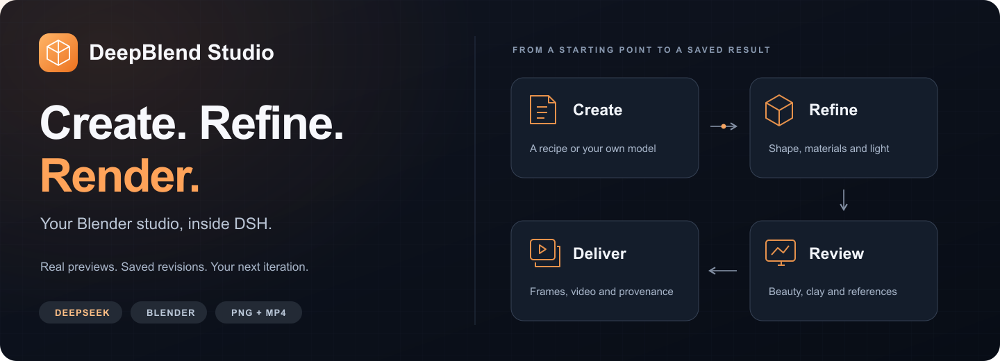
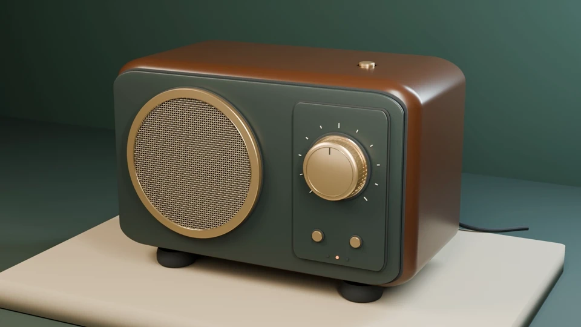
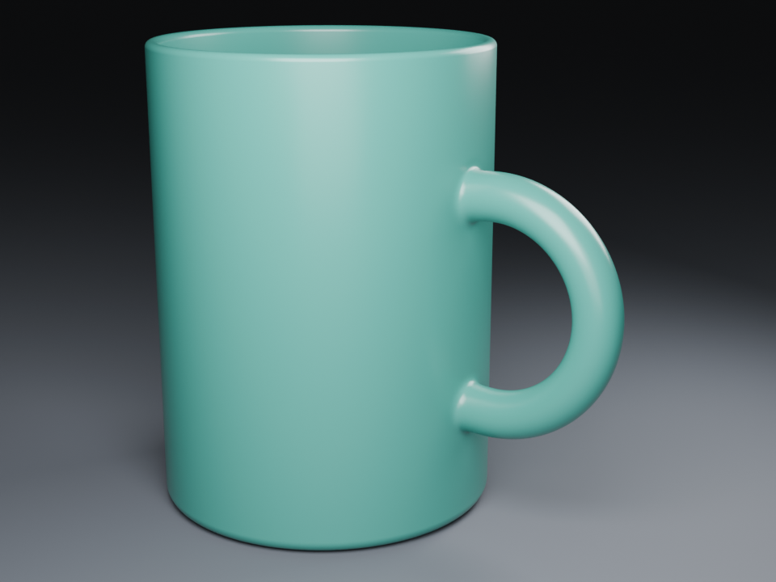
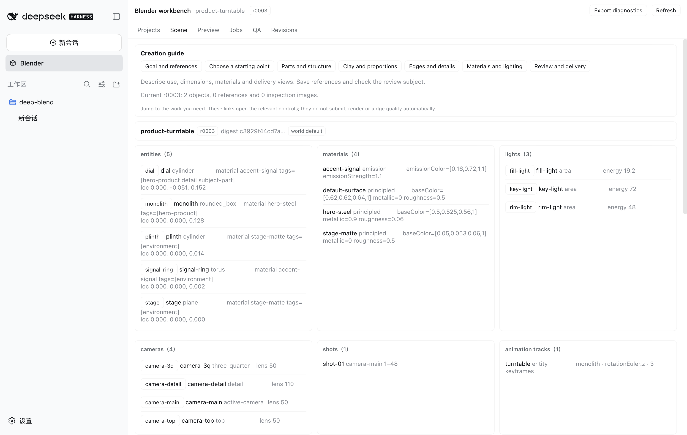
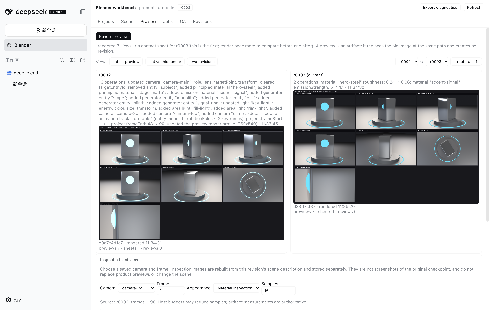
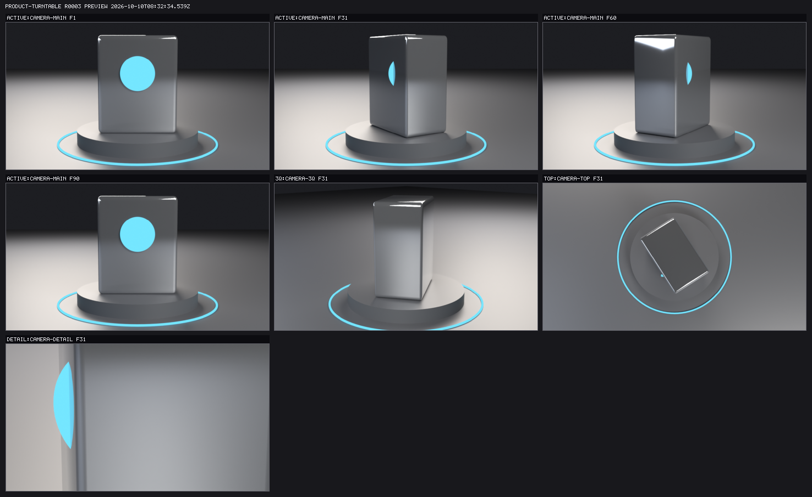

# DeepBlend Studio



[](https://awesome-dsh-plugin.com)

<p align="center">
<strong>Your Blender studio, inside DeepSeek Harness.</strong><br>
Start with a product recipe or your own model. Shape the scene. Compare real renders. Deliver the result.
</p>

<p align="center">
<a href="https://www.npmjs.com/package/@deepblend/dsh-blender-bundle"></a>
<a href="https://github.com/pearjelly/deep-blend/actions/workflows/ci.yml"></a>
<a href="LICENSE"></a>
</p>

**English** · [简体中文](README.zh.md)

[Quick start](#quick-start) · [See the workbench](#see-the-workbench) · [Documentation](deepblend/docs/README.md) · [Latest release](https://github.com/pearjelly/deep-blend/releases/latest) · [Contribute](CONTRIBUTING.md)

## Quick start

With **Node.js 22.23.3 or newer**, **DSH 0.1.5-rc.2**, **pnpm** and **Blender 5.2.1** ready:

```sh
dsh plugin --profile web add @deepblend/dsh-blender-bundle
dsh web
```

Restart an already running `dsh web` after installation. In a new session, choose the **DeepBlend Studio**
preset and open **Blender** in the sidebar. Both the workbench and agent presets are included.

**First time setting up Blender or DSH?** Follow the [English / Chinese quick-start guide](deepblend/docs/quick-start.md).
FFmpeg and ffprobe are needed when encoding an MP4. Install them with `brew install ffmpeg` on macOS,
`sudo apt install ffmpeg` on Debian/Ubuntu, or `winget install ffmpeg` on Windows. You can create and render scenes before adding them.

<details>
<summary><strong>Other install paths and upgrading an existing installation</strong></summary>

Prebuilt bundle:

```sh
dsh plugin --profile web add https://github.com/pearjelly/deep-blend/releases/latest/download/deepblend-bundle.tgz
```

Current source tree:

```sh
dsh plugin --profile web add 'github:pearjelly/deep-blend#path:/packages/deepblend/bundle'
```

The quoted `#path:` form keeps the shell from treating `#` as a comment. Source installs may need the build approval
reported by DSH; follow that message. **pnpm** must be on `PATH` for every install route.

Already installed? Replace the existing registration before adding the new package, then restart `dsh web`:

```sh
dsh plugin --profile web remove @deepblend/dsh-blender-bundle
dsh plugin --profile web add @deepblend/dsh-blender-bundle
```

See the [installation and upgrade guide](deepblend/docs/install.md) for configuration and storage details.

</details>

## Real work: light and material

Three product studies made with the locally installed DeepBlend plugin: amber glass, a champagne-metal lamp and a speaker with a physical woven grille. Each includes a high-resolution hero, a material close-up and a **6-second / 1080p / 24 fps** camera animation.

| 琥珀时间 · Amber Atlas | 金色暮光 · Solstice | 织声 · Nocturne |
| --- | --- | --- |
| [](deepblend/docs/assets/showcase/amber-atlas-hero.png) | [](deepblend/docs/assets/showcase/solstice-hero.png) | [](deepblend/docs/assets/showcase/nocturne-hero.png) |
| [Play MP4](deepblend/docs/assets/showcase/amber-atlas.mp4) | [Play MP4](deepblend/docs/assets/showcase/solstice.mp4) | [Play MP4](deepblend/docs/assets/showcase/nocturne.mp4) |

The inline previews sample the actual films at 12 fps; the MP4s retain all 144 rendered frames at 24 fps. Click a preview for its 2560×1440 still.

[Open the gallery](https://pearjelly.github.io/deep-blend/) · [Scene sources and rebuild](deepblend/showcase/README.md) · [Render provenance](deepblend/docs/assets/showcase/manifest.json) · [Official Blender visual references](deepblend/showcase/REFERENCES.md)

The scenes and output come from editable SceneSpec and actual rendering. Official Blender examples informed the lighting and material direction; no official demo model, texture or movie frame is used in these works.

## Make something concrete

These are **actual Blender renders**, with [reproducible source scenes and image provenance](deepblend/benchmarks/previews/manifest.json).
The cup image comes from the [recorded tutorial](deepblend/docs/assets/creator-tutorial/manifest.json).

| Metal task lamp | Glass and ceramic |
| --- | --- |
| [Cycles render of a metal task lamp](deepblend/benchmarks/previews/metal-lamp-hero.png) | [Cycles render of a hollow glass vessel and ceramic tray](deepblend/benchmarks/previews/glass-ceramic-hero.png) |
| **Desktop speaker** | **Glazed handled cup** |
| [Cycles render of a desktop speaker](deepblend/benchmarks/previews/modular-speaker-hero.png) |  |

Pick a [recipe](deepblend/docs/recipes.md), adjust its exposed color, roughness and exposure, and create a project with a rendered preview.
Or start with your own glTF, GLB or OBJ model and its external textures.

**Follow a complete creation:** the [glazed cup walkthrough](deepblend/docs/creator-tutorial.md) changes height,
compares clay views, adjusts the glaze and key light, and delivers a frame. Its handle roots still show visible
bulges; the tutorial preserves that limitation. The recipe has no animation tracks, so adding frames does not create turntable motion.

## Choose how you work

| Start here | What you do | Guide |
| --- | --- | --- |
| **Create in the workbench** | Use a recipe or import a model; edit dimensions, materials, cameras and lights | [Workbench guide](deepblend/docs/usage.md) |
| **Work with an agent** | Describe a scene, inspect previews and make bounded changes with the DeepBlend Studio preset | [Agent creation guide](deepblend/docs/quick-start.md#work-with-an-agent) |
| **Build your own recipes or tools** | Validate scene documents and content through the typed public SDK | [Authoring SDK](deepblend/docs/public-api.md) |

The agent preset provides **17 model-visible tools** for scenes, assets, previews, visual review and delivery.
You can use the gallery and manual workbench controls for your first creation before asking an agent to edit it.

Try this in a session using the DeepBlend Studio preset:

> List the available product recipes. Show me the glazed handled cup and its parameters before creating anything.
> After I choose the values, create a preview. Keep later material and lighting changes in separate revisions.

This is an example request, not a recorded run. Use the [tool guide](deepblend/docs/tool-contracts.md) to inspect what each operation does.

## From a starting point to a saved result

| Step | In the studio | What stays inspectable |
| --- | --- | --- |
| **Create** | Start from a recipe or upload a model bundle, texture or environment map | Recipe version, original resource paths and source bytes |
| **Refine** | Edit shape, bevels, arrays, local materials and procedural surface grain; adjust cameras and lights | A new saved scene revision for each accepted change |
| **Review** | Compare previews, inspect fixed-view beauty/clay images, and save reference images with a design goal | The actual image, camera, frame and render conditions |
| **Deliver** | Render PNG frames and encode an MP4; cancel or resume a job | Frame progress, actual render settings and delivery provenance |

[Assets](deepblend/docs/assets.md) · [Modeling](deepblend/docs/modeling.md) · [Photography](deepblend/docs/photography-editor.md) · [Inspection](deepblend/docs/inspection.md) · [Recovery](deepblend/docs/recovery.md)

## See the workbench

The following images were captured from a running DSH workbench, Chrome and Blender by
`deepblend/tools/capture-docs-images.mjs`. They are **product screenshots and render output**, separate from the illustrated brand banner above.



<details>
<summary><strong>Preview comparison and the rendered contact sheet</strong></summary>

The comparison displays actual saved previews from two revisions; image and source hashes are retained in the capture manifest.



The contact sheet combines animation sample frames with additional inspection viewpoints.



</details>

## Why the iteration stays inspectable

- **Saved history.** An accepted edit creates an immutable revision. Restoration moves the current pointer while keeping the intervening history.
- **Source-led scenes.** **SceneSpec is the source of truth; `.blend` is a compiled artifact.** Scenes can be rebuilt from the declared inputs and locked resources.
- **Recoverable delivery.** Frame files are checked rather than trusted from a counter. Resume renders missing or invalid frames; complete frames can proceed directly to encoding.
- **Explicit render budgets.** Expensive operations use an approval gate, and the requested scene revision remains attached to the job.
- **Separate kinds of evidence.** Technical measurements and image-backed artistic review are distinct; a higher score does not establish a better-looking result.

[Artistic review](deepblend/docs/artistic-review.md) · [Runtime and recovery](deepblend/docs/recovery.md) · [Security controls](deepblend/docs/security.md)

## Documentation by task

| I want to… | Start here |
| --- | --- |
| Install, configure Blender, or update the plugin | [Quick start](deepblend/docs/quick-start.md) · [Installation](deepblend/docs/install.md) |
| Complete my first creation | [Cup walkthrough](deepblend/docs/creator-tutorial.md) |
| Import my own model, textures or environment | [Asset library](deepblend/docs/assets.md) |
| Tune the shape or photography | [Modeling](deepblend/docs/modeling.md) · [Camera and light editing](deepblend/docs/photography-editor.md) |
| Compare versions and investigate a rough result | [Fixed-view inspections](deepblend/docs/inspection.md) · [References](deepblend/docs/reference-images.md) |
| Resume a render or recover a saved scene | [Recovery](deepblend/docs/recovery.md) |
| Author a recipe or integrate the SDK | [Recipes](deepblend/docs/recipes.md) · [Public API](deepblend/docs/public-api.md) |
| Contribute, reproduce evidence or inspect limitations | [Contributing](CONTRIBUTING.md) · [Acceptance register](deepblend/docs/milestone-status.md) |

Browse the [documentation hub](deepblend/docs/README.md). Detailed operation manuals are primarily in Chinese;
the quick-start guide and public authoring entry are available in English.

## Questions before you start

<details>
<summary><strong>Do I need an AI model to create my first project?</strong></summary>

The workbench gallery, editing controls and local renders can be used directly. Agent conversation and model-based visual review use the model configured in DSH.

</details>

<details>
<summary><strong>Does this replace Blender's desktop editor?</strong></summary>

DeepBlend builds and iterates declared scenes through its supported workbench controls and runtime contract.
It requires a Blender installation. The [modeling guide](deepblend/docs/modeling.md) describes the supported generators and edits.

</details>

<details>
<summary><strong>Where do my projects live?</strong></summary>

An ordinary installation stores projects below your DSH home. Source-development tools can use a repository-local store.
See [storage and recovery](deepblend/docs/install.md) before changing that configuration.

</details>

<details>
<summary><strong>Are every platform and every artistic result validated?</strong></summary>

The managed Blender download targets macOS arm64; other platforms require their own Blender installation and configuration.
CI also checks selected Linux x64 paths. Actual coverage and open artistic/user-adoption work are recorded in the [acceptance register](deepblend/docs/milestone-status.md).

</details>

Blender's upstream Linux download is `linux-x64`; Linux arm64 needs a distribution package or a self-built Blender.
The repository's managed installer targets macOS arm64. See the [platform details](deepblend/docs/install.md#0-前提)
for executable paths and the limits of cross-platform validation.

## For contributors

**SceneSpec → Blender runtime → preview / frames → review / delivery.** The master specification is [SPEC.md](SPEC.md).
The host composition owns shared services; the agent preset owns a session's model-visible tools; the runtime executes controlled Blender work.

| Development prerequisite | Declared floor |
| --- | --- |
| **Node.js** | ≥ 22 for the packages; the DSH CLI needs 22.23.3+ |

```sh
npm run dev:setup
npm run dev:test
```

Full native acceptance remains a separate entry:

```sh
bash deepblend/tests/run-all.sh      # 35 suites; README.zh.md carries the measured snapshot
```

[Development setup](deepblend/development/README.md) · [CI scope and artifacts](deepblend/docs/ci.md) · [Architecture decisions](deepblend/docs/architecture-decisions.md)

## Release and community

[Latest release](https://github.com/pearjelly/deep-blend/releases/latest) · [Changelog](CHANGELOG.md) · [Report a bug](https://github.com/pearjelly/deep-blend/issues/new/choose) · [Propose a feature](https://github.com/pearjelly/deep-blend/issues/new/choose)

**MIT** — [License](LICENSE). Security reports follow [SECURITY.md](SECURITY.md). Read [CONTRIBUTING.md](CONTRIBUTING.md)
for development and evidence requirements. The Chinese README retains the measured test totals and their caveats;
per-milestone conclusions are kept in the acceptance register.
