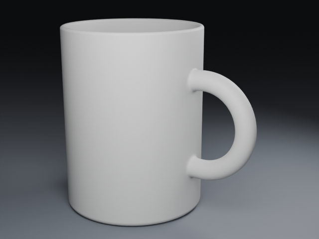
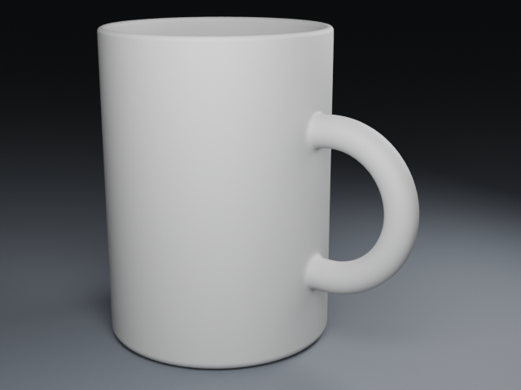

# 青釉杯：改尺寸、材质和灯光，再交付一帧

从内置「青釉带把手杯」3.0.0 开始，把杯子调高 5 mm，分别比较釉面与主灯的变化，最后交付一帧。先按[安装说明](install.md)配置插件、Blender、FFmpeg 和 ffprobe，再打开 Blender 工作台。

## 1. 创建杯子

在「项目」→「从作品配方开始」找到「青釉带把手杯」，点击「使用这个配方」。保留默认釉色、主表面粗糙度 **0.22**、摄影曝光 **0**，填写标题并点击「创建并生成预览」。等待真实图片出现，记下当前版本号。

配方示例图不会随草稿重绘。下面每一步都要保存后再判断实际图片。

## 2. 先留基线，再把高度改为 110 mm

打开「预览对比」→「固定视角检查」，设置：

| 项目 | 值 |
|---|---|
| 检查相机 | hero |
| 检查帧 | 1 |
| 显示方式 | 中性灰模 |
| 采样数 | 32 |

点击「生成检查图」，在「独立检查图」核对版本、相机、帧号及实际设置。

回到「场景树」，点击对象 **cup**。在「编辑对象」→「形状与轮廓」把「高度（mm）」从 **105** 改为 **110**，点击「应用并预览」。本次只改高度，保留其他尺寸与缩放。

新版本保存后，再生成同样的 **hero / 第 1 帧 / 中性灰模 / 32 samples** 检查图。用「独立检查图」的「查看版本」切换新旧版本，分别「打开原图」比较高宽比例、杯口和把手位置。查看历史图片不会恢复场景；生成检查图仍针对当前保存版本。

本次走查中，创建与对象应用的普通预览使用第 24 帧。比较形体时使用上面两张第 1 帧检查图，并核对实际分辨率、采样和相机条件一致。

下面是同机位、同设置的实际灰模检查图；杯柄连接处的凸起仍然可见。

| 高度 105 mm | 高度 110 mm |
|---|---|
|  |  |

## 3. 单独调整釉面粗糙度

先在当前版本生成 **hero / 第 1 帧 / 材质检查图 / 32 samples**，留下外观基线。

回「场景树」选择 **cup**，在「表面材质」保留「仅当前目标（复制材质）」。全选「粗糙度」的旧值，输入 **0.28**，点击「应用并预览」。再用相同设置生成材质检查图，与上一版比较杯口和把手的反光范围。

输入只改变草稿；留空时不能应用。粗糙度影响反射，不会增加几何细节。

## 4. 只增加主灯功率

在「场景树」→「摄影：相机与灯光」选择「编辑与检查相机」**hero**、「编辑灯光」**key**。

把「功率（W）」从 **0.65** 改为 **0.9**，保留相机、光源位置、颜色和灯尺寸。设置「检查帧」**1**、「采样数」**32**，点击「保存并预览」。这一步先保存新版本，再生成该版本的材质检查图。

在「独立检查图」比较前后两版 hero 图：观察杯身亮部和暗部是否还保留层次。更亮并不一定更合适。若提示修订已保存但图片失败，点击「重试已保存修订的预览」即可重试图片。

摄影位置和灯尺寸使用米，对象尺寸使用毫米。此处选择 hero 是选择编辑和检查相机；本配方的交付相机本来也是 hero。

## 5. 核对保存的版本

全新项目按上述顺序完成后，本次走查保存了以下四版：

| 版本 | 杯高 | 粗糙度 | key 功率 |
|---|---:|---:|---:|
| r0001 | 105 mm | 0.22 | 0.65 W |
| r0002 | 110 mm | 0.22 | 0.65 W |
| r0003 | 110 mm | 0.28 | 0.65 W |
| r0004 | 110 mm | 0.28 | 0.9 W |

在「预览对比」选择「两个 revision」，选定前后版本并点击「看结构差异」，确认每一步只改变预期字段。摄影检查图在「独立检查图」中；需要普通预览时，可为当前版本点击「渲染预览」。

杯把上下连接处仍有可见凸起。灰模和釉面图都能看到，增加采样不能消除这种形状问题。保存或交付成功也不代表美术效果通过。

## 6. 输出一帧

确认当前版本后打开「任务」，将「帧起」和「帧止」都填 **1**，`profile` 选择 **final**，点击「启动」。本配方 final 设置为 **960×720、Cycles、128 samples**，实际执行仍受 Host 预算限制。

等待任务显示 **completed** 和「交付已校验」。按任务卡片中的视频路径打开文件检查画面。单帧 PNG 在项目目录的 `renders/<任务 ID>/frames/frame_0001.png`；工作台目前没有直接下载最终帧的按钮。

这次交付生成 **1 张 PNG 和 1 帧、24 fps 的 MP4**，视频约 **1/24 秒**，没有转台运动。配方没有动画轨道，增加帧数不会自动让杯子或相机运动。需要保留视频时先另存副本，下一次交付会更新项目的 `output/final.mp4`。

上图为实际交付的原始 PNG，未作后期修改；它展示本教程的运行结果，杯柄根部仍需改进。

三张图片的来源提交、保存场景摘要与渲染设置见[图片来源清单](assets/creator-tutorial/manifest.json)。

继续调整形状可看[建模指南](modeling.md)，摄影字段和保存规则见[摄影编辑](photography-editor.md)。

### 实测范围

保存与渲染链路由助手在提交 `325b099` 完成真实 19 步走查，形成上述 4 个修订。按钮名称按提交 `cbd378e` 对应的界面核对；该版本另行验证了数值草稿和中英文切换，没有在本次教程中重新执行青釉杯的保存与渲染。安装、恢复旧版本和动画创作不属于这次走查范围。
